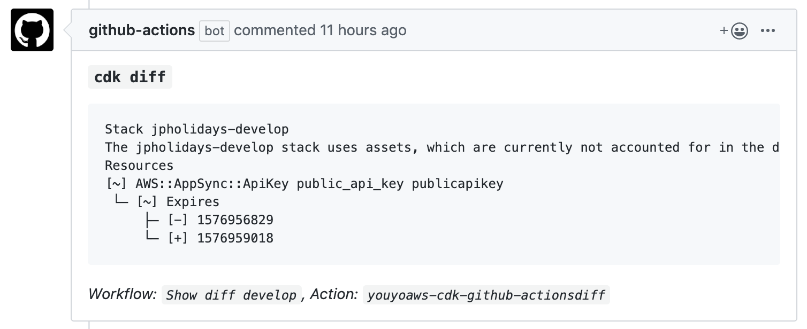

# AWS-CDK GitHub Actions

AWS-CDK GitHub Actions allow you to run `cdk deploy` and `cdk diff` on your pull requests to help you review.

## Actions

### [Diff Action](diff/)

Runs `cdk diff` and comments back with the output.

### [Deploy Action](deploy/)

Runs `cdk deploy --require-approval never` and comments back with the output.

## License

[MIT](LICENSE)
